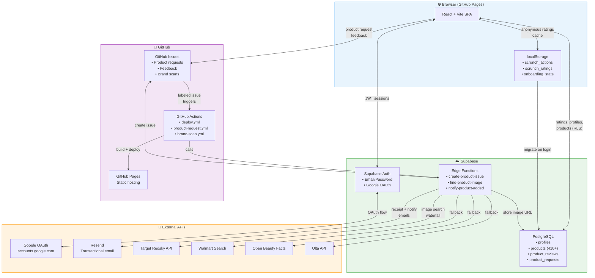

# Scrunch — Data Flow Architecture

> Curly hair product discovery app with OCR-free product requests and community ratings.

## Platform Summary

| Layer | Service |
|-------|---------|
| **Hosting** | GitHub Pages (`spaltrowitz.github.io/scrunch/`) |
| **CI/CD** | GitHub Actions (typecheck → test → build → deploy) |
| **Database** | Supabase PostgreSQL (`rqmplfyuonkikdmqngrj.supabase.co`) |
| **Auth** | Supabase Auth (email/password + Google OAuth) |
| **Email** | Resend API |
| **Issue Tracking** | GitHub API (product requests, feedback, brand scans) |
| **Product Images** | Target Redsky, Walmart, Open Beauty Facts, Ulta (scraped via Edge Functions) |
| **Serverless** | Supabase Edge Functions (create-product-issue, find-product-image, notify-product-added) |
| **Client Storage** | localStorage (anonymous ratings cache, saved products) |

## Data Flow

## Key Data Flows

1. **Product Discovery**: User browses → Supabase products table → filtered by curl pattern
2. **Rating (Logged In)**: User rates → Supabase product_reviews (RLS enforced)
3. **Rating (Anonymous)**: User rates → localStorage → migrated to Supabase on login
4. **Product Request**: User submits → Edge Function → GitHub Issue created → Resend receipt email
5. **Image Scraping**: GitHub Action triggers → Edge Function → Target → Walmart → OBF → Ulta (waterfall) → URL stored in Supabase
