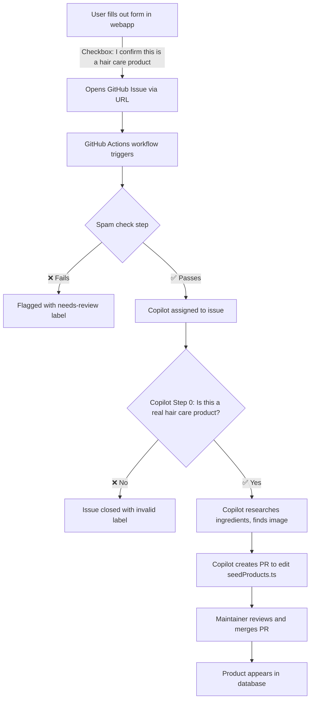

# Product Request Workflow

How a user-submitted product request becomes a product in the Scrunch database.

## Validation layers

| Layer | Where | What it checks |
|-------|-------|----------------|
| **Frontend form** | `RequestProductForm.tsx` | Confirmation checkbox, input length, suspicious patterns |
| **GitHub Issue template** | `.github/ISSUE_TEMPLATE/product-request.yml` | Category dropdown limited to hair care, required fields |
| **Actions spam check** | `.github/workflows/product-request.yml` | Brand/product name quality, repeated chars, test words |
| **Copilot Step 0** | `.github/copilot-instructions.md` | Verifies product is real hair care, not a duplicate, not spam |
| **PR review** | Human maintainer | Final approval before merge |

## Database write access

Products are **never written by end users**. The `products` table has no client-side insert/update RLS policies — only the Supabase service role (used by admin/CI) can write to it. All products enter through seed data PRs.

The `product_requests` table requires authentication for inserts, in case a native in-app request queue is built in the future.

## Image sourcing policy

Product images must come from approved sources to avoid copyright and Terms of Service violations.

| Source | Status | Notes |
|--------|--------|-------|
| Brand's own website | ✅ Allowed | Preferred source — brand owns the copyright |
| Open Beauty Facts | ✅ Allowed | Open license, community-contributed |
| Amazon CDN | ❌ Prohibited | Aggressive ToS enforcement |
| Target CDN (`target.scene7.com`) | ❌ Prohibited | Hotlinking violates ToS |
| Ulta CDN (`media.ulta.com`) | ❌ Prohibited | Hotlinking violates ToS |
| Walmart CDN (`walmartimages.com`) | ❌ Prohibited | Hotlinking violates ToS |
| Walgreens CDN | ❌ Prohibited | Hotlinking violates ToS |
| Sally Beauty CDN | ❌ Prohibited | Hotlinking violates ToS |

See `.github/copilot-instructions.md` for the full image search waterfall and validation rules.
